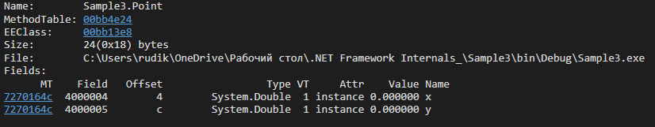
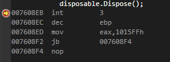

# Internal-device-types-in-.NET-Framework.-Resource-management

Ссылочные типы хранятся на куче. Указатель на кучу находится в стеке. Данный объект(класса Employee) занимает 16 байт. по 4 байта приходится на int. 4 на заголовок объекта и 4 на таблицу указателей методов.
​

Типы значений хранятся в стеке. На скрине представлена упакованная структура(преобразованна в ссылочный тип), которая хранится на куче.
​

Таблица методов объекта класса Employee. В ней хранятся все методы(виртуальные и невиртуальные). 
Не все скомплированы т.к JIT компилирует метод при первом обращении к нему.
​

Последовательность выбора виртуального метода в таблице методов остается одинаковой как в базовом классе, так и в дочернем.
​

Выбор невиртуального метода не требует обращение к таблице методов т.к адрес для вызова уже имеется. 
В регистр ecx записывается ссылка на объект. В регистр edx значение аргумента, которое передали в метод.

​

Вызов методов интерфейса отличается от виртуальных т.к в таблице методов объектов разных классов 
они могут оказаться в разных местах. Вызов напрямую интерфейсных методов сказывается на производительности, 
поэтому компилятор использует различные способы оптимизации этого процесса.

​

